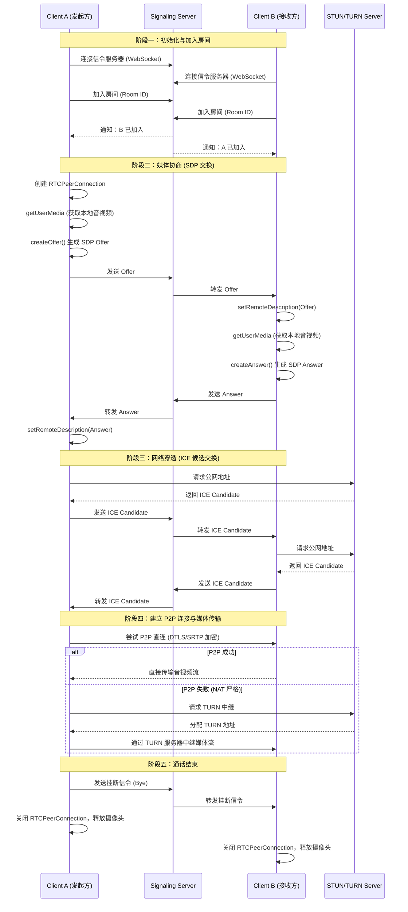
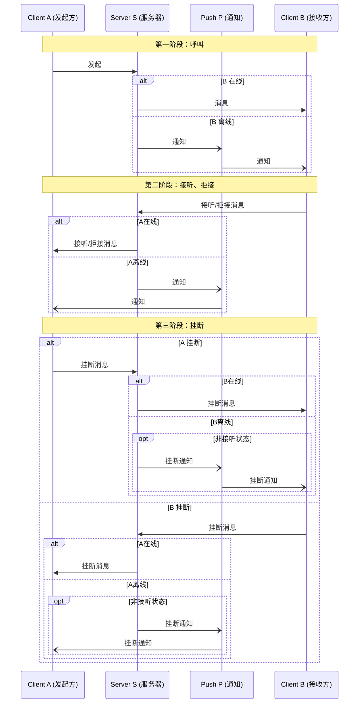
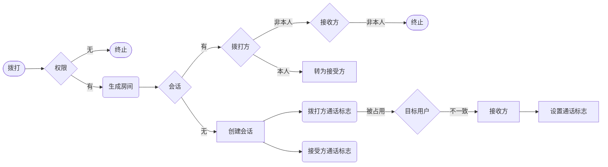

# RTC说明

## 1. 简介
| 术语   | 中文名         | 英文名                                 |
| ------ | -------------- | -------------------------------------- |
| WebRTC | 网页实时通信   | Web Real-Time Communication            |
| NAT    | 网络地址转换   | Network Address Translation            |
| STUN   | 探路员         | Session Traversal Utilities for NAT    |
| TURN   | 中转站         | Traversal Using Relays around NAT      |
| ICE    | 总指挥         | Interactive Connectivity Establishment |
| SDP    | 通信合同       | Session Description Protocol           |
| RTP    | 实时传输协议   | Real-time Transport Protocol           |
| SRTP   | 安全传输协议   | Secure Transport Protocol              |
| SCTP   | 流控制传输协议 | Stream Control Transmission Protocol   |
| SFU    | 选择性转发(服务器收到音视频流后，不做处理，直接转发给需要的人)      | Selective Forwarding Unit              |
| MCU    | 多路复用器(服务器收到所有人的音视频流后，混合成一路，再发给每个人)      | Multiplexing and demultiplexing unit   |

## 2. 音视频通话时序图

## 3. 音视频发起呼叫时序图

## 4. 发起通话流程图

## 5. 参考资料
- [告别“只闻其名”！一文带你深入浅出 WebRTC，并用 Go 搭建你的第一个实时应用](https://juejin.cn/post/7517547443140018176)
- [使用Go和WebRTC data channel实现端到端实时通信](https://tonybai.com/2023/09/23/p2p-rtc-implementation-with-go-and-webrtc-data-channel/)
- [Trickle ICE](https://webrtc.github.io/samples/src/content/peerconnection/trickle-ice/)
- [什么是SFU架构？与MCU、P2P的区别和应用场景](https://www.shengwang.cn/blog/blogdetail/sfu-wiki/)
- [markdown 画图总结](https://juejin.cn/post/7631856130399191050)
- [Mermaid 语法文档](https://mermaid.nodejs.cn/syntax/sequenceDiagram.html)

